# 00 — Overview

## What source.dot.net is

[`source.dot.net`](https://source.dot.net) is a navigable and searchable HTML view of the .NET source code, including [`dotnet/runtime`](https://github.com/dotnet/runtime), [`dotnet/aspnetcore`](https://github.com/dotnet/aspnetcore), [`dotnet/roslyn`](https://github.com/dotnet/roslyn), [`dotnet/winforms`](https://github.com/dotnet/winforms), [`dotnet/wpf`](https://github.com/dotnet/wpf), [`dotnet/msbuild`](https://github.com/dotnet/msbuild), and others. The full list lives in [`src/index/repositories.props`](../../src/index/repositories.props).

The actual rendering engine is [KirillOsenkov/SourceBrowser](https://github.com/KirillOsenkov/SourceBrowser). This repo:

1. **Vendors (copies) a fork of SourceBrowser** into this repo under [`src/SourceBrowser/`](../../src/SourceBrowser). Yes — the SourceBrowser source code is physically checked in here rather than referenced as a NuGet package or git submodule. The exact upstream commit it was copied from is recorded in [`src/SourceBrowser.hash`](../../src/SourceBrowser.hash). **Note:** while the original intent was to periodically re-sync from upstream via [`src/update-source-browser.ps1`](../../src/update-source-browser.ps1), the fork has diverged significantly (~21 local commits since the last sync in [PR #184](https://github.com/dotnet/source-indexer/pull/184)) and **a blind re-sync is no longer recommended** — see [02 — Build & local dev](02-build-and-local-dev.md#updating-the-vendored-sourcebrowser) for the full divergence list and guidance.
2. **Adds MSBuild orchestration (clone → prepare → index) on top of the vendored SourceBrowser.** SourceBrowser by itself only knows how to turn a single solution/binlog into HTML. To produce `source.dot.net` we need to drive that across ~15 dotnet repos. So this repo layers an MSBuild project ([`build.proj`](../../build.proj) → [`src/index/index.proj`](../../src/index/index.proj)) that runs three steps in order: **Clone** (git-clone the V1 repos and download the V2 stage1 bundles from blob storage), **Prepare** (run each V1 repo's Arcade build to produce binlogs), and **BuildIndex** (feed all of those binlogs/solutions into SourceBrowser's `HtmlGenerator.exe` to produce the static HTML index). Each step is its own MSBuild target so the pipeline can interleave Azure auth between them. See [03 — Indexing pipeline](03-indexing-pipeline.md) for the deep dive.
3. **Ships a daily Azure DevOps pipeline** ([`azure-pipelines.yml`](../../azure-pipelines.yml)) that runs those three steps, uploads the resulting index to Azure blob storage, deploys the web app, and swaps slots so `source.dot.net` serves the fresh data.

## End-to-end data flow

The diagram below maps each box to one of the three orchestration targets from `build.proj` (**Clone** / **Prepare** / **BuildIndex**) and shows *where* each step actually runs — the V1 path does everything inside the source-indexer pipeline, while the V2 path offloads `Clone+Prepare` to each upstream repo's own Arcade-driven pipeline.

```mermaid
flowchart LR
    subgraph v2_upstream["V2 upstream repos (runtime, aspnetcore, roslyn, …)"]
        direction TB
        V2BUILD["Their own Arcade pipeline<br/>with <b>enableSourceIndex: true</b><br/><i>= remote Clone + Prepare</i><br/>(BinLogToSln + UploadIndexStage1)"]
    end

    subgraph stage1["Azure Storage: netsourceindexstage1"]
        S1[("stage1 container<br/>per-repo .tar.gz<br/>binlog + src")]
    end

    subgraph build["source-indexer pipeline (1ES, daily 10:00 UTC) — runs build.proj"]
        direction TB
        subgraph step_clone["① Clone target"]
            CV1["V1 repos: git clone here"]
            CV2["V2 repos: <b>DownloadStage1Index</b> MSBuild task<br/>downloads .tar.gz from stage1"]
        end
        subgraph step_prepare["② Prepare target"]
            P["V1 repos only:<br/>run each repo's Arcade build locally<br/>to produce binlogs<br/><i>(V2 repos already have binlogs from stage1)</i>"]
        end
        subgraph step_index["③ BuildIndex target"]
            I["HtmlGenerator.exe<br/>indexes V1 binlogs + V2 stage1 solutions<br/>→ searchable HTML"]
        end
        step_clone --> step_prepare --> step_index
    end

    subgraph storage["Azure Storage: netsourceindexprod"]
        BLOB[("index-GUID container<br/>per build")]
    end

    subgraph app["Azure App Service: netsourceindexprod"]
        STG["staging slot"]
        PRD["production slot"]
    end

    V2BUILD -- "upload via UploadIndexStage1" --> S1
    S1 --> CV2
    CV1 --> P
    CV2 --> I
    P --> I
    I -- "index files" --> BLOB
    I -- "web app binaries" --> STG
    BLOB -- "SOURCE_BROWSER_INDEX_PROXY_URL" --> STG
    STG -- "slot swap" --> PRD
    PRD -- "serves" --> User(["source.dot.net"])
```

**How to read this:**

- **V1 path** (legacy, source-indexer-pipeline-owned): the source-indexer pipeline performs *all three* targets — `Clone` (git clone), `Prepare` (run their Arcade build to make a binlog), then `BuildIndex`. Everything happens on our agents.
- **V2 path** (preferred, distributed via Arcade): the upstream repo opts in by setting `enableSourceIndex: true` on Arcade's `jobs.yml` template. Their pipeline runs `BinLogToSln` + `UploadIndexStage1` to push a tarball to `netsourceindexstage1`. Our pipeline's `Clone` target then just downloads that bundle (via the `DownloadStage1Index` MSBuild task) — the `Prepare` step is skipped because the binlog already exists — and `BuildIndex` runs as normal.
- The classification of which repo uses which path lives in [`src/index/repositories.props`](../../src/index/repositories.props) (`V1Repository` vs `V2Repository` items). See [03 — Indexing pipeline](03-indexing-pipeline.md) for the per-target deep dive and [04 — Arcade integration](04-arcade-and-dotnet-integration.md#32-how-an-upstream-repo-uses-it-via-arcades-enablesourceindex) for the V2 onboarding flow.

## Key moving parts

| Component | Lives in | Purpose |
|---|---|---|
| **HtmlGenerator** (`Microsoft.SourceBrowser.HtmlGenerator.exe`) | `src/SourceBrowser/src/HtmlGenerator` | The .NET Framework tool that turns binlogs/solutions into the static HTML index. |
| **SourceIndexServer** | `src/SourceBrowser/src/SourceIndexServer` | ASP.NET Core app hosted on `netsourceindexprod`. Reads index files from blob storage at runtime (via `SOURCE_BROWSER_INDEX_PROXY_URL`). |
| **`Microsoft.SourceIndexer.Tasks`** | `src/Microsoft.SourceIndexer.Tasks` | Custom MSBuild tasks consumed by `build.proj` (`DownloadStage1Index`, `SelectProjects`, `ResolveLivePackageReferences`). |
| **`UploadIndexStage1`** dotnet tool | `src/UploadIndexStage1` | `dotnet tool` published as a NuGet package. Other dotnet repos consume it inside Arcade to push stage1 bundles to `netsourceindexstage1`. |
| **`build.proj` / `src/index/index.proj`** | repo root + `src/index` | MSBuild orchestration targets: `Clone`, `Prepare`, `BuildIndex`, `Build`, `Rebuild`, `Clean`, `SelectProjects`. |
| **`azure-pipelines.yml`** | repo root | 1ES Azure DevOps pipeline that runs daily and deploys the result. |
| **`deployment/*.ps1`** | `deployment/` | Helper scripts for slot deployment: create container, set app setting, normalize case, cleanup. |

## Glossary

- **Stage1** — the per-repo bundle (binlog + source tree + hash) that upstream dotnet repos publish to `netsourceindexstage1` storage. The source indexer downloads these instead of building those repos itself.
- **V1 repository** — a repo this pipeline still clones and builds locally with Arcade (`iot`, `msbuild`, `performance`, `sdk` at the time of writing). Declared as `<Repository>` items.
- **V2 repository** — a repo that has onboarded to stage1 and ships pre-built binlogs. Declared as `<RepositoryV2>` items. Strongly preferred.
- **Slot** — Azure App Service deployment slot. `production`, `staging` (used by the official prod pipeline), and `validation` (used by the non-official validation pipeline).
- **Container** (Azure context) — a blob container in `netsourceindexprod`/`netsourceindexvalidprod` holding the index files for a single build. Each build creates a new GUID-named container; the app setting `SOURCE_BROWSER_INDEX_PROXY_URL` points the web app at the current one.
- **HtmlGenerator** — `Microsoft.SourceBrowser.HtmlGenerator.exe`, the build-time .NET Framework tool that produces the static HTML index.
- **Index** — the output of HtmlGenerator: tens of GB of static HTML/JSON files served by `SourceIndexServer` at runtime.
