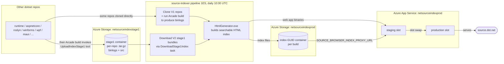

# 00 — Overview

## What source.dot.net is

[`source.dot.net`](https://source.dot.net) is a navigable and searchable HTML view of the .NET source code, including [`dotnet/runtime`](https://github.com/dotnet/runtime), [`dotnet/aspnetcore`](https://github.com/dotnet/aspnetcore), [`dotnet/roslyn`](https://github.com/dotnet/roslyn), [`dotnet/winforms`](https://github.com/dotnet/winforms), [`dotnet/wpf`](https://github.com/dotnet/wpf), [`dotnet/msbuild`](https://github.com/dotnet/msbuild), and others. The full list lives in [`src/index/repositories.props`](../../src/index/repositories.props).

The actual rendering engine is [KirillOsenkov/SourceBrowser](https://github.com/KirillOsenkov/SourceBrowser). This repo:

1. **Vendors a fork** of SourceBrowser under [`src/SourceBrowser/`](../../src/SourceBrowser) (kept in sync via a patch-based workflow — see [02 — Build & local dev](02-build-and-local-dev.md)).
2. Adds MSBuild orchestration (clone → prepare → index) on top.
3. Ships a daily Azure DevOps pipeline that produces and deploys a new index.

## End-to-end data flow

## Key moving parts

| Component | Lives in | Purpose |
|---|---|---|
| **HtmlGenerator** (`Microsoft.SourceBrowser.HtmlGenerator.exe`) | `src/SourceBrowser/src/HtmlGenerator` | The .NET Framework tool that turns binlogs/solutions into the static HTML index. |
| **SourceIndexServer** | `src/SourceBrowser/src/SourceIndexServer` | ASP.NET Core app hosted on `netsourceindexprod`. Reads index files from blob storage at runtime (via `SOURCE_BROWSER_INDEX_PROXY_URL`). |
| **`Microsoft.SourceIndexer.Tasks`** | `src/Microsoft.SourceIndexer.Tasks` | Custom MSBuild tasks consumed by `build.proj` (`DownloadStage1Index`, `SelectProjects`, `ResolveLivePackageReferences`). |
| **`UploadIndexStage1`** dotnet tool | `src/UploadIndexStage1` | `dotnet tool` published as a NuGet package. Other dotnet repos consume it inside Arcade to push stage1 bundles to `netsourceindexstage1`. |
| **`build.proj` / `src/index/index.proj`** | repo root + `src/index` | MSBuild orchestration targets: `Clone`, `Prepare`, `BuildIndex`, `Build`, `Rebuild`, `Clean`, `SelectProjects`. |
| **`azure-pipelines.yml`** | repo root | 1ES Azure DevOps pipeline that runs daily and deploys the result. |
| **`deployment/*.ps1`** | `deployment/` | Helper scripts for slot deployment: create container, set app setting, normalize case, cleanup. |

## Glossary

- **Stage1** — the per-repo bundle (binlog + source tree + hash) that upstream dotnet repos publish to `netsourceindexstage1` storage. The source indexer downloads these instead of building those repos itself.
- **V1 repository** — a repo this pipeline still clones and builds locally with Arcade (`iot`, `msbuild`, `performance`, `sdk` at the time of writing). Declared as `<Repository>` items.
- **V2 repository** — a repo that has onboarded to stage1 and ships pre-built binlogs. Declared as `<RepositoryV2>` items. Strongly preferred.
- **Slot** — Azure App Service deployment slot. `production`, `staging` (used by the official prod pipeline), and `validation` (used by the non-official validation pipeline).
- **Container** (Azure context) — a blob container in `netsourceindexprod`/`netsourceindexvalidprod` holding the index files for a single build. Each build creates a new GUID-named container; the app setting `SOURCE_BROWSER_INDEX_PROXY_URL` points the web app at the current one.
- **HtmlGenerator** — `Microsoft.SourceBrowser.HtmlGenerator.exe`, the build-time .NET Framework tool that produces the static HTML index.
- **Index** — the output of HtmlGenerator: tens of GB of static HTML/JSON files served by `SourceIndexServer` at runtime.
