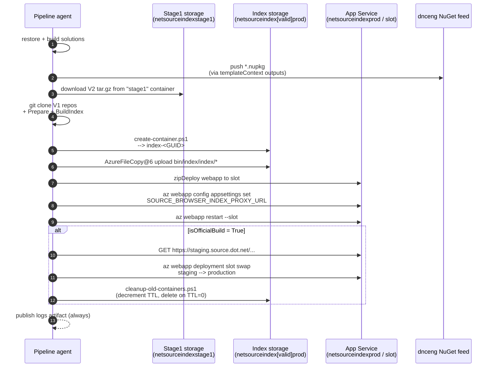

# 05 — Azure Pipeline Walk-through

This document describes the Azure DevOps pipeline that builds and deploys
[source.dot.net](https://source.dot.net). It is the single authoritative
walk-through of [`azure-pipelines.yml`](../../azure-pipelines.yml) and the
weekly CodeQL pipeline [`azure-pipelines-codeql.yml`](../../azure-pipelines-codeql.yml).

For the inventory of the Azure resources this pipeline talks to, see
[`06-azure-infrastructure.md`](./06-azure-infrastructure.md).

---

## 1. Pipeline at a glance

| Property | Value |
| --- | --- |
| Pipeline file | [`azure-pipelines.yml`](../../azure-pipelines.yml) |
| Azure DevOps project | `dnceng/internal` |
| Build definition ID | `612` — [latest run](https://dev.azure.com/dnceng/internal/_build/latest?definitionId=612&branchName=main) |
| Schedule | Daily at `10:00 UTC` on `main`, with `always: true` (runs even when there are no new commits) |
| Trigger | Schedule only — there is no `trigger:` / `pr:` section, so CI/PR triggers come from the AzDO UI configuration. **TODO (tribal knowledge):** confirm what CI/PR triggers are configured in the AzDO definition outside of YAML. |
| Template | [`v1/1ES.Official.PipelineTemplate.yml@1ESPipelineTemplates`](https://eng.ms/docs/cloud-ai-platform/devdiv/one-engineering-system-1es/1es-docs/1es-pipeline-templates/onboarding/overview) from the `1ESPipelineTemplates/1ESPipelineTemplates` ADO repo (`refs/tags/release`) |
| Network isolation policy | `Permissive,CFSClean2` |
| Custom build tag | `ES365AIMigrationTooling` |
| Job timeout | `360` minutes |
| Agent OS | `windows` |
| 1ES agent image | `1es-pt-agent-image` |

`system.debug` is set to `true` at pipeline scope, so every step emits verbose
logs by default.

---

## 2. Branch / PR gating — prod vs. validation

The pipeline runs the *same* set of steps in two modes: a real **production**
deploy and a **validation** deploy. The gate is a single template-expression
block near the top of [`azure-pipelines.yml`](../../azure-pipelines.yml):

```yaml
${{ if and(ne(variables['System.TeamProject'], 'public'),
           notin(variables['Build.Reason'], 'PullRequest'),
           eq(variables['Build.SourceBranch'], 'refs/heads/main')) }}:
```

All three conditions must be true to take the **PROD** branch:

1. Not running in the `public` AzDO project (i.e. we are in `dnceng/internal`).
2. Not a `PullRequest` build.
3. Branch is `refs/heads/main`.

Anything else (PRs, non-`main` branches, builds in `public`) gets the
**VALIDATION** variable set.

| Variable | PROD (official) | VALIDATION |
| --- | --- | --- |
| `poolName` | `NetSourceIndexProd-Pool` | `NetSourceIndexValid-Pool` |
| `azureSubscriptionForStorageAndWebAppSlot` | `NetSourceIndex-Prod` | `NetSourceIndex-Validation-Prod` |
| `storageAccountName` | `netsourceindexprod` | `netsourceindexvalidprod` |
| `temporaryDeploymentSlot` | `staging` | `validation` |
| `stagingHost` | `staging.source.dot.net` | *(not set — smoke test is skipped)* |
| `isOfficialBuild` | `True` | `False` |

Variables that are **shared** across both flows (defined unconditionally at
pipeline scope):

| Variable | Value |
| --- | --- |
| `webAppName` | `netsourceindexprod` |
| `resourceGroupName` | `source.dot.net` |
| `azureSubscriptionForStage1Download` | `SourceDotNet Stage1 Publish` |
| `system.debug` | `true` |

Note that the same web app (`netsourceindexprod`) is used for *both* flows —
only the deployment slot differs (`staging` vs. `validation`). The
`validation` slot is **never** swapped into production; it only exists so PRs
and non-`main` builds can exercise the full deploy path end-to-end.

The subscription-name variables must live at pipeline scope (not inside a
job/template) because `AzureCLI@2` resolves them very early in pipeline
processing — see
[azure-pipelines-tasks#14365](https://github.com/microsoft/azure-pipelines-tasks/issues/14365#issuecomment-2286398867).

`isOfficialBuild` gates the three "real" deployment steps (smoke test, slot
swap, container cleanup) — all three carry
`condition: and(succeeded(), eq(variables['isOfficialBuild'], 'True'))`.

---

## 3. templateContext outputs

The 1ES template wraps the job and reads two outputs from `templateContext`:

| Output | Purpose |
| --- | --- |
| `nuget` push | Pushes everything in `$(Build.ArtifactStagingDirectory)/packages/*.nupkg` to the internal `dnceng` feed `9ee6d478-d288-47f7-aacc-f6e6d082ae6d/d1622942-d16f-48e5-bc83-96f4539e7601`. These packages are produced by the `dotnet build` step below and include `Microsoft.SourceIndexer.Tasks` and `UploadIndexStage1`. |
| `pipelineArtifact` `logs` | Always (`condition: always()`) publishes `$(Build.ArtifactStagingDirectory)/logs` as a pipeline artifact named `logs`. This contains the MSBuild binary logs (`clone.binlog`, `prepare.binlog`, `build.binlog`, plus every other `*.binlog` produced under the sources directory). |

---

## 4. Step-by-step walk-through

All steps run inside a single job (`BuildIndex`, displayName **Build Source
Index**) in a single stage (`stage`).

### 4.1 `checkout: self`

```yaml
- checkout: self
  clean: true
  submodules: true
```

Pulls this repo plus its git submodules (notably
[`src/SourceBrowser`](../../src/SourceBrowser)), with a fresh working
directory.

### 4.2 Delete `bin/` contents

`DeleteFiles@1` removes everything under `bin/**` before the build starts.
Guards against stale artifacts being picked up by later copy/upload steps.

### 4.3 Install the pinned .NET SDK

`UseDotNet@2` with `useGlobalJson: true` installs the SDK pinned by
[`global.json`](../../global.json). Update the SDK by editing `global.json`,
not the YAML.

### 4.4 `dotnet restore`

Runs `dotnet restore` over `**\*.sln`. This restores every solution file in
the tree, including both
[`src\source-indexer.sln`](../../src/source-indexer.sln) and
[`src\SourceBrowser\SourceBrowser.sln`](../../src/SourceBrowser/SourceBrowser.sln).

### 4.5 `dotnet build`

```yaml
projects: |
  src\source-indexer.sln
  src\SourceBrowser\SourceBrowser.sln
arguments: '/p:PackageOutputPath=$(Build.ArtifactStagingDirectory)/packages /p:EnableDebugLogging=true'
```

Builds both solutions in the default `Debug` configuration. This is the step
where the two NuGet packages that get published by the pipeline output
(`Microsoft.SourceIndexer.Tasks`, `UploadIndexStage1`) are emitted into
`$(Build.ArtifactStagingDirectory)/packages`.

### 4.6 Clone Stage1 data

```yaml
- task: AzureCLI@2
  displayName: 🟣Clone Stage1 data
  inputs:
    azureSubscription: SourceDotNet Stage1 Publish
    addSpnToEnvironment: true
  inlineScript: |
    dotnet build build.proj /t:Clone /v:n /bl:.../clone.binlog \
      /p:Stage1StorageAccount=netsourceindexstage1 \
      /p:Stage1StorageContainer=stage1
```

Runs against the `SourceDotNet Stage1 Publish` subscription with `addSpnToEnvironment: true`,
which puts the service-principal credentials into env vars the MSBuild task can
read. The `/t:Clone` target in [`build.proj`](../../build.proj) does two things
in one pass:

- **V2 repos** — downloads pre-built per-repo `.tar.gz` bundles from the
  `stage1` container in the `netsourceindexstage1` storage account
  (uploaded there by other dotnet repositories' CI).
- **V1 repos** — does plain `git clone`s for repos that aren't yet using the
  Stage1 publish flow.

### 4.7 Prepare All Repositories

```yaml
dotnet build build.proj /t:Prepare /bl:.../prepare.binlog
```

Runs Arcade-style restore + minimal build over the V1 repos that were
git-cloned in the previous step, so the source indexer has the binaries it
needs to resolve symbols. V2 repos skip this because they already contain
pre-built artifacts.

### 4.8 Build source index

```yaml
dotnet build build.proj /t:BuildIndex /bl:.../build.binlog
```

This is the long-running step. It invokes the SourceBrowser indexer over all
prepared repos and writes the generated HTML index to `bin\index\index\`,
with the website binaries and `wwwroot/` going to `bin\index\`.

### 4.9 Copy webapp files

```yaml
- task: CopyFiles@2
  sourceFolder: bin/index/
  contents: |
    **
    !index/**
  targetFolder: bin/webapp-stage/
  cleanTargetFolder: true
```

Splits the build output into two trees:

- `bin\webapp-stage\` — the ASP.NET Core webapp binaries and static
  content (`wwwroot/`), small.
- `bin\index\index\` — the generated source index HTML/TXT files, large.

The webapp gets zip-deployed to App Service (step 4.14); the index gets
uploaded to blob storage (step 4.13). Keeping them separate is what makes
the index swappable behind a single env var.

### 4.10 Create `.health` file

```powershell
New-Item -ItemType File -Force -Path bin/index/index/.health
```

Drops an empty marker file inside the index tree. **TODO (tribal
knowledge):** confirm what — if anything — consumes this file at runtime
(the FIXME'd `/health` endpoints suggest it was a liveness signal before
they were disabled; see step 4.17).

### 4.11 Normalize case

Runs [`deployment/normalize-case.ps1`](../../deployment/normalize-case.ps1)
against `bin\index\index\`. Azure Blob Storage is **case-sensitive**, but
the webapp serves requests through `ToLowerInvariant()`d paths (see
[`Helpers.cs`](../../src/SourceBrowser/src/SourceIndexServer/Helpers.cs)
line 67). The script walks the index tree and renames any entry whose name
differs from its lowercase form (using a `.tmp` two-phase rename so that
case-only renames work on case-insensitive Windows).

### 4.12 Create new storage container

```yaml
inlineScript: deployment/create-container.ps1 -StorageAccountName $(storageAccountName)
```

[`create-container.ps1`](../../deployment/create-container.ps1) creates a
new private container named `index-<GUID-no-dashes>` in the slot-appropriate
storage account, then publishes the name as the
`NEW_CONTAINER_NAME` pipeline variable via
`##vso[task.setvariable variable=NEW_CONTAINER_NAME]...`.

Each build gets its own container — there is no in-place mutation of an
existing one. Older containers are reaped later by step 4.19.

### 4.13 Upload index to Azure Storage

```yaml
- task: AzureFileCopy@6
  SourcePath: "bin/index/index/*"
  Destination: AzureBlob
  storage: $(storageAccountName)
  ContainerName: $(NEW_CONTAINER_NAME)
```

Uploads the full normalized index tree into the new container.

### 4.14 Deploy webapp to slot

```yaml
- task: AzureRmWebAppDeployment@4
  WebAppName: netsourceindexprod
  ResourceGroupName: source.dot.net
  deployToSlotOrASE: true
  SlotName: $(temporaryDeploymentSlot)   # staging | validation
  packageForLinux: bin/webapp-stage/
  DeploymentType: zipDeploy
  RemoveAdditionalFilesFlag: true
```

Zip-deploys the webapp from `bin/webapp-stage/` into either the `staging`
slot (PROD flow) or the `validation` slot (validation flow).
`RemoveAdditionalFilesFlag: true` ensures we don't accumulate stale files
across deployments. Even though the input is `packageForLinux:`, the slot
itself runs on Windows — the parameter name is a quirk of the task.

### 4.15 Deploy the storage proxy URL

```yaml
inlineScript: >
  deployment/deploy-storage-proxy.ps1
  -NewContainerName "$(NEW_CONTAINER_NAME)"
  -ResourceGroup "$(resourceGroupName)"
  -StorageAccountName "$(storageAccountName)"
  -WebappName "$(webAppName)"
  -Slot "$(temporaryDeploymentSlot)"
```

[`deploy-storage-proxy.ps1`](../../deployment/deploy-storage-proxy.ps1)
computes:

```
https://<storageAccount>.blob.core.windows.net/<NEW_CONTAINER_NAME>
```

and writes it as the **`SOURCE_BROWSER_INDEX_PROXY_URL`** app setting on
that slot (`az webapp config appsettings set ... --slot ...`). This is the
contract that `SourceIndexServer` reads via
[`Helpers.IndexProxyUrl`](../../src/SourceBrowser/src/SourceIndexServer/Helpers.cs):

```csharp
public static string IndexProxyUrl =>
    Environment.GetEnvironmentVariable("SOURCE_BROWSER_INDEX_PROXY_URL");
```

The web app at runtime opens an `AzureBlobFileSystem` against this URL for
every `.html`/`.txt` request — so changing this app setting is what makes
a new index "go live" on a slot.

### 4.16 Restart the slot

```
az webapp restart --name $(webAppName) --slot $(temporaryDeploymentSlot) --resource-group $(resourceGroupName)
```

Forces the app to pick up the new `SOURCE_BROWSER_INDEX_PROXY_URL`.

### 4.17 Smoke test (PROD only)

```yaml
condition: and(succeeded(), eq(variables['isOfficialBuild'], 'True'))
```

After a `Start-Sleep 60`, issues a `GET` against:

1. `https://$(stagingHost)`  → `https://staging.source.dot.net`
2. `https://$(stagingHost)/System.Private.CoreLib/src/libraries/System.Private.CoreLib/src/System/String.cs.html`

Anything other than `200` writes a `##vso[task.logissue type=warning;]`.
Note that the YAML explicitly marks the `/health` and `/health/alive`
endpoints as `FIXME: Health endpoints disabled till they can be audited`
— don't expect them to work even though the empty `.health` file is still
shipped in the index (step 4.10).

The validation flow has no `stagingHost` variable, which is why this step
is gated on `isOfficialBuild`.

### 4.18 Slot swap (PROD only)

```
az webapp deployment slot swap
  --resource-group $(resourceGroupName)
  --name $(webAppName)
  --slot $(temporaryDeploymentSlot)   # staging
  --target-slot production
```

This is the moment new code/index "goes live" at https://source.dot.net.
Validation builds never reach this step because of the `isOfficialBuild`
gate. After the swap, what was in `staging` is now in `production` and
vice-versa — meaning the previous production index/binaries can be
rolled back to by another swap (see [`06-azure-infrastructure.md`](./06-azure-infrastructure.md)
for the rollback note).

### 4.19 Cleanup old storage containers (PROD only)

```yaml
inlineScript: >
  deployment/cleanup-old-containers.ps1
  -ResourceGroup $(resourceGroupName)
  -WebappName $(webAppName)
  -StorageAccountName $(storageAccountName)
```

[`cleanup-old-containers.ps1`](../../deployment/cleanup-old-containers.ps1)
enumerates every container in the storage account, subtracts the two
containers currently referenced by `SOURCE_BROWSER_INDEX_PROXY_URL` on the
`production` and `staging` slots, and walks the remaining set:

- Read the container's `TTL` metadata (default `10`, set by
  [`util.ps1::Get-ContainerTTL`](../../deployment/util.ps1)).
- If `TTL > 0`: decrement and persist (`Set-ContainerTTL`) — the container
  survives this run.
- If `TTL <= 0`: `az storage container delete`.

In effect, a container that stops being referenced gets deleted ~10 builds
later. This is the implementation of the README's *"Delete storage
containers that haven't been used by the app service in the last 10
builds"* claim, and is what bounds the practical rollback window. See
[`06-azure-infrastructure.md`](./06-azure-infrastructure.md#container-lifecycle--ttl)
for the rollback procedure.

### 4.20 Copy binlogs for upload (always)

```yaml
condition: succeededOrFailed()
continueOnError: true
```

Globs `**/*.binlog` from `$(Build.SourcesDirectory)` into
`$(Build.ArtifactStagingDirectory)/logs/src`. Combined with the
`templateContext.outputs.pipelineArtifact` declaration (step 3), this is
what makes the binlogs downloadable from every run, including failed ones.

---

## 5. Anatomy of a build

```mermaid
flowchart TD
    A[checkout self<br/>+ submodules] --> B[Delete bin/]
    B --> C[UseDotNet@2<br/>global.json]
    C --> D[dotnet restore<br/>all *.sln]
    D --> E[dotnet build<br/>source-indexer.sln<br/>SourceBrowser.sln<br/>--> packages/*.nupkg]
    E --> F[AzureCLI: Clone Stage1<br/>build.proj /t:Clone<br/>V2 tar.gz + V1 git clones]
    F --> G[Prepare V1 repos<br/>build.proj /t:Prepare]
    G --> H[Build source index<br/>build.proj /t:BuildIndex<br/>--> bin/index/...]
    H --> I[Split outputs<br/>bin/webapp-stage/<br/>vs bin/index/index/]
    I --> J[Create .health file]
    J --> K[normalize-case.ps1<br/>lowercase filenames]
    K --> L[create-container.ps1<br/>--> NEW_CONTAINER_NAME]
    L --> M[AzureFileCopy@6<br/>upload index to blob]
    M --> N[AzureRmWebAppDeployment@4<br/>zipDeploy webapp<br/>to slot]
    N --> O[deploy-storage-proxy.ps1<br/>set SOURCE_BROWSER_INDEX_PROXY_URL]
    O --> P[az webapp restart slot]
    P --> Q{isOfficialBuild?}
    Q -- True --> R[Smoke test<br/>staging.source.dot.net]
    R --> S[az webapp slot swap<br/>staging --> production]
    S --> T[cleanup-old-containers.ps1<br/>TTL = 10 builds]
    Q -- False --> U[validation flow stops here]
    T --> V[Copy *.binlog --> logs artifact]
    U --> V
    V --> W[1ES outputs:<br/>nuget push + logs artifact]
```

The same picture as a sequence diagram between the moving parts:



---

## 6. The CodeQL pipeline

[`azure-pipelines-codeql.yml`](../../azure-pipelines-codeql.yml) is a
separate, lighter pipeline.

| Property | Value |
| --- | --- |
| File | [`azure-pipelines-codeql.yml`](../../azure-pipelines-codeql.yml) |
| Trigger | `trigger: none` — schedule only |
| Schedule | `0 12 * * 1` — Mondays at `12:00 UTC` on `main`, `always: true` |
| Pool | `NetCore1ESPool-Internal`, image override `windows.vs2019.amd64` |
| Stage / job | `CodeQL` / `codeql_windows` |
| Parameter | `TSAEnabled` (bool, default `true`) — controls whether results are published to TSA. Flip to `false` when testing CodeQL fixes locally before merging. |

Steps (in order):

1. `UseDotNet@2` (`useGlobalJson: true`).
2. `CodeQL3000Init@0`.
3. `dotnet restore` over all `*.sln`.
4. `dotnet build` of both solutions (same project list as the main pipeline)
   with `/p:PackageOutputPath=$(Build.ArtifactStagingDirectory)/packages`.
   The packages are *not* published; this build only exists to give CodeQL a
   tracer-instrumented compilation.
5. `CodeQL3000Finalize@0`.

Pipeline-scope variables disable CG (`skipComponentGovernanceDetection=true`,
since CG runs in the primary pipeline) and force-enable CodeQL irrespective
of branch or extension cadence (`Codeql.Enabled=true`,
`Codeql.Cadence=0`, `Codeql.TSAEnabled=${{ parameters.TSAEnabled }}`).

---

## 7. Operational quick reference

```powershell
# What is the latest run of build definition 612?
Start-Process "https://dev.azure.com/dnceng/internal/_build/latest?definitionId=612&branchName=main"

# What slot is currently serving production traffic for the web app?
az webapp deployment slot list `
  --name netsourceindexprod `
  --resource-group source.dot.net `
  --query "[].{slot:name, state:state, host:defaultHostName}" -o table

# Which container is each slot pointing at right now?
az webapp config appsettings list `
  --name netsourceindexprod `
  --resource-group source.dot.net `
  --query "[?name=='SOURCE_BROWSER_INDEX_PROXY_URL'].value | [0]" -o tsv

az webapp config appsettings list `
  --name netsourceindexprod `
  --resource-group source.dot.net `
  --slot staging `
  --query "[?name=='SOURCE_BROWSER_INDEX_PROXY_URL'].value | [0]" -o tsv

# Roll back the production slot to a previous index (one slot swap).
az webapp deployment slot swap `
  --resource-group source.dot.net `
  --name netsourceindexprod `
  --slot staging `
  --target-slot production
```

For the underlying resources these commands touch, continue to
[`06-azure-infrastructure.md`](./06-azure-infrastructure.md).
