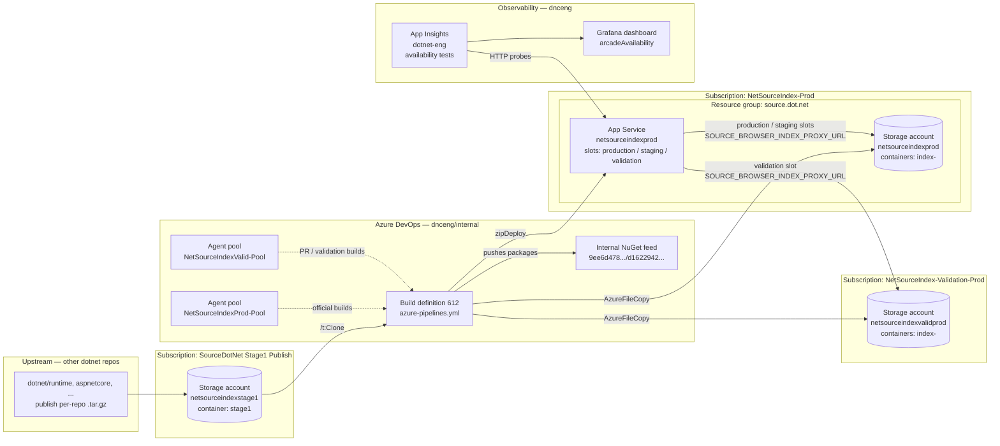

# 06 — Azure Infrastructure Inventory

This is the inventory of every Azure resource referenced — directly or
indirectly — by [`azure-pipelines.yml`](../../azure-pipelines.yml) and the
scripts under [`deployment/`](../../deployment/). It is meant to give a new
on-call enough to find, inspect, and rotate every moving part of
[source.dot.net](https://source.dot.net).

For *how* the pipeline drives these resources, see
[`05-azure-pipeline.md`](./05-azure-pipeline.md).

---

## 1. Top-level map



---

## 2. Resource group

| Property | Value |
| --- | --- |
| Name | `source.dot.net` |
| Hosts | App Service `netsourceindexprod`, storage account `netsourceindexprod` |
| Subscriptions touching it | `NetSourceIndex-Prod` (primary, owns the RG **TODO (tribal knowledge):** confirm); `NetSourceIndex-Validation-Prod` (used by validation builds writing to a separate storage account whose RG / subscription assignment we cannot fully verify from this repo — see §5) |

`source.dot.net` is the only resource group named directly in YAML
([`azure-pipelines.yml`](../../azure-pipelines.yml) variable
`resourceGroupName`). All `az webapp ...` calls in
[`deploy-storage-proxy.ps1`](../../deployment/deploy-storage-proxy.ps1) and
[`cleanup-old-containers.ps1`](../../deployment/cleanup-old-containers.ps1)
use it.

**TODO (tribal knowledge):** confirm region, tags, lock state, and the
resource-group-level RBAC assignments for `source.dot.net` — none of that
is captured in this repo.

---

## 3. App Service: `netsourceindexprod`

A single Windows-hosted ASP.NET Core App Service. Used for **both** the
production flow and the validation flow — only the deployment slot
differs.

| Property | Value | Source |
| --- | --- | --- |
| Name | `netsourceindexprod` | `webAppName` in [`azure-pipelines.yml`](../../azure-pipelines.yml) |
| Resource group | `source.dot.net` | `resourceGroupName` |
| Deployment kind | `zipDeploy` of `bin/webapp-stage/` from the pipeline | `AzureRmWebAppDeployment@4` task |
| Public hostnames | `source.dot.net` (production slot), `staging.source.dot.net` (staging slot) | Smoke-test URL in [`azure-pipelines.yml`](../../azure-pipelines.yml); README "What Is It?" / "Monitoring" sections |
| OS | Windows (the README states the indexer is a .NET Framework exe and the build is Windows-only) | [`README.md`](../../README.md) |

### 3.1 Slots

| Slot | Purpose | Receives deploys when… | Ever swapped to production? |
| --- | --- | --- | --- |
| `production` | Live traffic on `source.dot.net` | Never deployed to directly — only reached via slot swap from `staging` | n/a (target of swaps) |
| `staging` | Pre-production for the official daily build. Hostname `staging.source.dot.net`. | `isOfficialBuild = True` (built from `main`, in `dnceng/internal`, not a PR) | **Yes** — every successful PROD run ends with `az webapp deployment slot swap --slot staging --target-slot production` |
| `validation` | Lets PR / non-`main` / `public`-project builds exercise the full deploy path. | `isOfficialBuild = False` | **No** — never swapped. Safe to redirect at any time. |

### 3.2 Key per-slot app setting

The runtime contract between the pipeline and the app is a single env var:

| App setting | Read by | Written by |
| --- | --- | --- |
| `SOURCE_BROWSER_INDEX_PROXY_URL` | `Helpers.IndexProxyUrl` in [`src/SourceBrowser/src/SourceIndexServer/Helpers.cs`](../../src/SourceBrowser/src/SourceIndexServer/Helpers.cs) (line 84) | [`deployment/deploy-storage-proxy.ps1`](../../deployment/deploy-storage-proxy.ps1) on every build |

Its value is:

```
https://<storageAccountName>.blob.core.windows.net/<index-<GUID>>
```

`SourceIndexServer.Helpers.ServeProxiedIndex` opens an
`AzureBlobFileSystem` against that URL on every request for an `.html` /
`.txt` resource, lower-cases the request path
(`ToLowerInvariant()`), checks for existence, and streams the blob
through. That's why
[`deployment/normalize-case.ps1`](../../deployment/normalize-case.ps1)
renames every file in the index to lowercase before upload — Azure Blob is
case-sensitive but the runtime always queries with a lowercase path.

The setting is **per slot**, so the production slot and the staging slot
can (and typically do) point at different containers at the same time.
That's also how slot swaps preserve the "old" index — after a swap, the
slot that used to be production now lives in `staging` with its
`SOURCE_BROWSER_INDEX_PROXY_URL` intact, pointing at the previously-live
container.

### 3.3 Hostnames / DNS / certificates

| Hostname | Slot | Notes |
| --- | --- | --- |
| `source.dot.net` | `production` | Apex-style hostname on `.dot.net` |
| `staging.source.dot.net` | `staging` | Used by the pipeline smoke test |

**TODO (tribal knowledge):** the repo does not say where the custom
hostname bindings, TLS certificates, or DNS records for `source.dot.net`
and `staging.source.dot.net` are managed. Specifically:

- Who owns the `dot.net` DNS zone and where it lives.
- Whether the TLS cert is App Service managed certificate, Key Vault, or
  a manually uploaded PFX, and where it's stored.
- Whether `validation` has a public hostname binding at all (no
  `stagingHost` is defined for that flow, and the smoke test is skipped).

### 3.4 Inspection / quick commands

```powershell
# Slot state
az webapp deployment slot list `
  --name netsourceindexprod `
  --resource-group source.dot.net -o table

# Read the proxy URL on every slot
foreach ($slot in @('production','staging','validation')) {
  $args = @('webapp','config','appsettings','list',
            '--name','netsourceindexprod',
            '--resource-group','source.dot.net',
            '--query',"[?name=='SOURCE_BROWSER_INDEX_PROXY_URL'].value | [0]",
            '-o','tsv')
  if ($slot -ne 'production') { $args += @('--slot', $slot) }
  Write-Host "$slot ->" (az @args)
}

# Pull the slot's full app settings (no secrets are stored here today — verify before sharing)
az webapp config appsettings list `
  --name netsourceindexprod `
  --resource-group source.dot.net `
  --slot staging
```

---

## 4. Storage accounts

Three distinct storage accounts are involved. They live in three different
Azure subscriptions.

| Account | Subscription | Role | Container layout | Auth from pipeline |
| --- | --- | --- | --- | --- |
| `netsourceindexprod` | `NetSourceIndex-Prod` | Index data for `production` + `staging` slots | One container `index-<GUID>` per official build. Cleaned up by `cleanup-old-containers.ps1`. | `azureSubscriptionForStorageAndWebAppSlot` service connection (`AzureCLI@2` / `AzureFileCopy@6`), `--auth-mode login` |
| `netsourceindexvalidprod` | `NetSourceIndex-Validation-Prod` | Index data for the `validation` slot | One container `index-<GUID>` per non-official build | Same as above, but the variable resolves to the validation service connection |
| `netsourceindexstage1` | `SourceDotNet Stage1 Publish` | **Input** to this pipeline. Holds the `stage1` container, into which other dotnet repos (`runtime`, `aspnetcore`, etc.) publish per-repo `.tar.gz` bundles consumed by `build.proj /t:Clone`. | Single container `stage1` with per-repo blobs | `azureSubscriptionForStage1Download` service connection with `addSpnToEnvironment: true` so MSBuild can read the SPN |

Each container is created by
[`create-container.ps1`](../../deployment/create-container.ps1) using:

```powershell
az storage container create `
  --name "index-$((New-Guid).ToString('N'))" `
  --auth-mode login `
  --public-access off `
  --fail-on-exist `
  --account-name $StorageAccountName
```

So containers are **private** — the web app reaches them with the
App Service slot's managed identity (or whatever identity is configured
on the `AzureBlobFileSystem`).

**TODO (tribal knowledge):** confirm exactly which identity the App
Service slots use to read the private index containers (managed identity?
storage account key in another app setting? SAS token?). Nothing in this
repo wires that up explicitly — `SOURCE_BROWSER_INDEX_PROXY_URL` is a bare
HTTPS URL with no credentials. The reasonable assumption is the App
Service has a managed identity granted **Storage Blob Data Reader** on
both `netsourceindexprod` and `netsourceindexvalidprod`, but it must be
verified in the portal / via `az role assignment list`.

### 4.1 Stage1 storage — `netsourceindexstage1`

This is the only storage account the pipeline reads *from*. The
`build.proj /t:Clone` target downloads per-repo `.tar.gz` bundles from the
`stage1` container (the V2 path); V1 repos are git-cloned in parallel.
The repo's CI never writes to `netsourceindexstage1` — that's owned by
the upstream publishers.

**TODO (tribal knowledge):** which upstream repos / pipelines own writes
to the `stage1` container, and what the contract is for new repos
on-boarding to the V2 (tar.gz) flow vs. the V1 (git-clone) flow.

---

## 5. Subscriptions

| Logical name (AzDO service connection) | Used for | Resources |
| --- | --- | --- |
| `NetSourceIndex-Prod` | Official-build deploys (`isOfficialBuild=True`) | App Service `netsourceindexprod`, storage `netsourceindexprod`, resource group `source.dot.net` |
| `NetSourceIndex-Validation-Prod` | Validation / PR deploys (`isOfficialBuild=False`) | Storage `netsourceindexvalidprod`; uses the same App Service `netsourceindexprod` (the `validation` slot) |
| `SourceDotNet Stage1 Publish` | Stage1 download only | Storage `netsourceindexstage1` |

The same App Service (`netsourceindexprod`) is reached from *both*
deployment service connections — the `validation` slot is deployed to via
`NetSourceIndex-Validation-Prod` while `staging` is deployed to via
`NetSourceIndex-Prod`. **TODO (tribal knowledge):** confirm RBAC: which
service principals are granted what on which slots/storage accounts, and
who owns rotating those credentials.

---

## 6. Agent pools (Azure DevOps)

| Pool | Used when | Configured in repo? |
| --- | --- | --- |
| `NetSourceIndexProd-Pool` | `isOfficialBuild = True` | Name only — pool definition is owned outside this repo |
| `NetSourceIndexValid-Pool` | `isOfficialBuild = False` | Same |
| `NetCore1ESPool-Internal` | CodeQL pipeline ([`azure-pipelines-codeql.yml`](../../azure-pipelines-codeql.yml)) | Name only |

All three are 1ES pools running the Windows agent image
`1es-pt-agent-image` (CodeQL overrides to `windows.vs2019.amd64`).

**TODO (tribal knowledge):** who owns / manages
`NetSourceIndexProd-Pool` and `NetSourceIndexValid-Pool`, where their
agent image lifecycle is configured (1ES Hosted Pools? Scale-set agents?),
and the contact to bump SKU / capacity.

---

## 7. NuGet feed (Azure Artifacts)

Configured as a `templateContext` `nuget` output in
[`azure-pipelines.yml`](../../azure-pipelines.yml):

| Property | Value |
| --- | --- |
| Feed type | `internal` (Azure Artifacts) |
| Feed ID | `9ee6d478-d288-47f7-aacc-f6e6d082ae6d/d1622942-d16f-48e5-bc83-96f4539e7601` (`<projectId>/<feedId>`, both in `dnceng`) |
| Packages pushed | Everything matching `$(Build.ArtifactStagingDirectory)/packages/*.nupkg` — produced by the `dotnet build` step. Today that is at least:<br/>• `Microsoft.SourceIndexer.Tasks` — the MSBuild tasks consumed by `build.proj` (notably `DownloadStage1Index` and the upload counterpart).<br/>• `UploadIndexStage1` — used by upstream repos to push their per-repo bundles into the `stage1` container. |
| Push cadence | Every build (PROD and validation alike — the `templateContext.outputs.nuget` block is unconditional) |

**TODO (tribal knowledge):** the human-readable name of this feed in the
dnceng AzDO UI is not in the repo. Resolve from
`https://dev.azure.com/dnceng/internal/_apis/packaging/feeds/d1622942-d16f-48e5-bc83-96f4539e7601`
or by browsing the project's *Artifacts* tab.

---

## 8. Container lifecycle / TTL

This is the single most important operational detail of the system. It is
implemented by
[`cleanup-old-containers.ps1`](../../deployment/cleanup-old-containers.ps1)
plus the `Get-ContainerTTL` / `Set-ContainerTTL` helpers in
[`util.ps1`](../../deployment/util.ps1).

**Mechanism:**

1. Every official build creates a brand-new container
   `index-<GUID>` and points the `staging` slot at it.
2. The slot swap (step 4.18 in [`05-azure-pipeline.md`](./05-azure-pipeline.md))
   promotes that container to be the one referenced by `production`.
3. Immediately after the swap, `cleanup-old-containers.ps1` runs and:
   - Lists every container in the storage account.
   - Reads `SOURCE_BROWSER_INDEX_PROXY_URL` from the `production` and
     `staging` slots and extracts the two "live" container names.
   - For every other container, reads its `TTL` metadata. Default is
     `10` (see `Get-ContainerTTL` in [`util.ps1`](../../deployment/util.ps1)
     line 24).
   - If `TTL > 0`: decrement (`Set-ContainerTTL ... ($ttl - 1)`).
   - If `TTL <= 0`: `az storage container delete`.

**Consequences:**

- An index that drops off both slots survives roughly **10 more builds**
  before deletion. With a daily schedule, that's ~10 days.
- Rollback to any of those last ~10 indexes is possible by repointing
  `SOURCE_BROWSER_INDEX_PROXY_URL` (or by a single slot swap, which
  effectively gives you the previous prod index back instantly).
- Once an index is deleted, the only way back is a fresh build.

**Rollback recipes:**

```powershell
# Option A — quickest. Swap staging back into prod (one transaction; gives you
# whatever was prod before the most recent deploy).
az webapp deployment slot swap `
  --resource-group source.dot.net `
  --name netsourceindexprod `
  --slot staging `
  --target-slot production

# Option B — point prod at an older index container directly (within the TTL
# window). List remaining containers first:
az storage container list `
  --account-name netsourceindexprod `
  --auth-mode login `
  --query "[].{name:name, ttl:metadata.TTL}" -o table

# Then set the app setting on the production slot to the chosen container:
az webapp config appsettings set `
  --resource-group source.dot.net `
  --name netsourceindexprod `
  --settings "SOURCE_BROWSER_INDEX_PROXY_URL=https://netsourceindexprod.blob.core.windows.net/index-<chosen-guid>"

# And restart so the AzureBlobFileSystem instance picks up the new env var:
az webapp restart --name netsourceindexprod --resource-group source.dot.net
```

If you want to **hold** a container across rollback debugging, bump its
TTL above 10 so the next cleanup pass won't decrement it to zero:

```powershell
az storage container metadata update `
  --account-name netsourceindexprod `
  --auth-mode login `
  --name index-<guid> `
  --metadata "TTL=100"
```

**TODO (tribal knowledge):** confirm whether validation-side containers
in `netsourceindexvalidprod` are also reaped — `cleanup-old-containers.ps1`
*is* invoked by the validation flow's storage subscription, but its
`isOfficialBuild` gating in [`azure-pipelines.yml`](../../azure-pipelines.yml)
means the step is **only** executed for official builds. So
`netsourceindexvalidprod` will accumulate `index-<GUID>` containers over
time unless something else trims them.

---

## 9. Diagnostics & observability

| Resource | Purpose | Link |
| --- | --- | --- |
| App Insights `dotnet-eng` | Runs availability tests against `https://source.dot.net` | **TODO (tribal knowledge):** subscription / resource group of `dotnet-eng` is not in this repo |
| Grafana dashboard `arcadeAvailability` | Alerts off the availability-test signals | [Service availability dashboard](https://dotnet-eng-grafana.westus2.cloudapp.azure.com/d/arcadeAvailability/service-availability?orgId=1&refresh=30s) |
| Pipeline `logs` artifact | Per-run binlogs (`clone.binlog`, `prepare.binlog`, `build.binlog`, plus everything under `$(Build.SourcesDirectory)/**/*.binlog`) | Always published by the pipeline (`condition: always()`); see [`05-azure-pipeline.md` §3](./05-azure-pipeline.md#3-templatecontext-outputs) |

The README summarizes this in two sentences — see
[README.md "Monitoring"](../../README.md#monitoring).

Deeper monitoring / on-call detail is covered in `08-*.md` (per the
handoff package layout).

---

## 10. What is **not** in this repo

This file deliberately enumerates the gaps the outgoing team needs to fill
in. Consolidated list:

- Resource-group region, tags, locks, and RBAC for `source.dot.net`.
- The custom-hostname binding, TLS certificate source, and DNS zone
  ownership for `source.dot.net` / `staging.source.dot.net`.
- Whether `validation` has a public hostname binding.
- The exact identity used by the App Service slots to read the private
  index containers (managed identity assumption stated above but not
  verified).
- RBAC of the three service connections (`NetSourceIndex-Prod`,
  `NetSourceIndex-Validation-Prod`, `SourceDotNet Stage1 Publish`) on
  their respective targets, and the rotation contact.
- Ownership of agent pools `NetSourceIndexProd-Pool` and
  `NetSourceIndexValid-Pool`.
- Upstream owners of the `stage1` container in `netsourceindexstage1`.
- Subscription / resource group of the `dotnet-eng` App Insights
  resource.
- Whether anything trims old `index-<GUID>` containers out of
  `netsourceindexvalidprod` (today's pipeline skips cleanup on validation
  builds).
