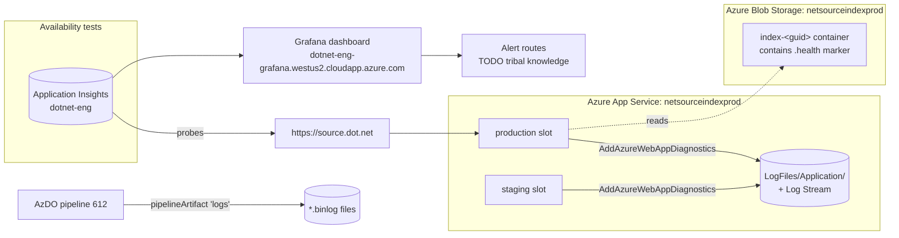

# 08 — Monitoring and runbook

> **Note on scope:** despite the original filename suggesting otherwise, this doc does **not** describe an on-call rotation, paging policy, or SLO commitments — none of those exist in any form discoverable from this repo. It covers (a) what observability surfaces the code/pipeline actually wires up, (b) the application/pipeline log surfaces a responder would consult, and (c) a runbook of common failure modes with pointers to investigate them. If there is or should be an on-call rotation, that's a separate organizational decision and is **not** documented here.

> 🚨 **DISCLAIMER: The "Application Insights" + "Grafana dashboard" claims below are likely OUTDATED — verify before trusting.**
>
> These references were sourced verbatim from this repo's [`README.md` "Monitoring" section](../../README.md), which says:
>
> > "https://source.dot.net is monitored using availability tests from the dotnet-eng application insights resource. Alerting is handled through grafana here https://dotnet-eng-grafana.westus2.cloudapp.azure.com/d/arcadeAvailability/service-availability"
>
> **However, the outgoing team (joperezr) has spot-checked the linked Grafana dashboard and reports that it now appears to be Helix/Arcade observability — there is no source.dot.net content on it.** It is possible that:
>
> 1. Dashboards/probes existed at one point and have since been removed or migrated elsewhere, and the README was never updated; or
> 2. They still exist but on a different dashboard/resource than what the README points at; or
> 3. There is no live observability for source.dot.net today.
>
> **Action items before this doc can be trusted:**
> - Confirm whether the `dotnet-eng` Application Insights resource still has availability tests targeting `source.dot.net`. If not — delete the "Availability tests" section below and the corresponding nodes from the diagram.
> - Confirm whether any Grafana dashboard (current URL or new one) hosts source.dot.net availability/alerting today. If not — delete the "Grafana dashboard" section.
> - Once confirmed, **update [`README.md`](../../README.md)** to reflect reality, then update this doc to match.
> - If no observability exists today, that is itself a finding worth raising with the incoming team — `AddAzureWebAppDiagnostics()` logs and pipeline binlogs would be the only signals available.

---

> ⚠️ **TODO @radical + outgoing team — please validate before relying on this doc.** Source-by-source provenance for the major claims:
>
> | Section | Source | Confidence |
> |---|---|---|
> | "Application Insights `dotnet-eng`" + Grafana availability dashboard URL | **Repo [`README.md` "Monitoring" section](../../README.md)** — copied verbatim. **Likely outdated, see disclaimer above.** | Low — needs live verification. |
> | App Service logs via `AddAzureWebAppDiagnostics()` | Read directly from [`Program.cs`](../../src/SourceBrowser/src/SourceIndexServer/Program.cs). | High (the line is in the code). |
> | `az webapp log tail` / `log download` commands | Generic Azure CLI knowledge; *not* validated against the actual resource. | Medium — commands are correct in form; resource group name `source.dot.net` is a guess pulled through from [doc 06](./06-azure-infrastructure.md) and inherits any errors there. |
> | `.health` marker mechanism + `StorageHealthCheck` behavior | Read from [`azure-pipelines.yml`](../../azure-pipelines.yml) and [`HealthChecks/StorageHealthCheck.cs`](../../src/SourceBrowser/src/SourceIndexServer/HealthChecks/StorageHealthCheck.cs). | High. |
> | Pipeline smoke tests + the "FIXME: Health endpoints disabled" call-out | Read directly from [`azure-pipelines.yml`](../../azure-pipelines.yml). | High. |
> | Common failure modes / runbook entries | Reverse-engineered from the scripts they reference. No actual incident was replayed. | Medium — the symptoms and "where to look" are grounded, but "Resolution" steps are inferred. |
>
> Same standing offer as docs 06 and 07: happy to regenerate from a narrated walkthrough rather than spot-fix.

---

This document covers what observability exists for `https://source.dot.net`, where to look first when things break, and the watch-outs the outgoing team has called out. The authoritative high-level pointer is the **Monitoring** section of the repo [`README.md`](../../README.md); this document expands on it.

A lot of the operational context (alert routing, who is paged, SLO targets, who has access to the monitoring estate) is tribal knowledge that is **not** discoverable from this repo. Those gaps are marked `**TODO (tribal knowledge):**` below and need to be filled in by the outgoing team before handoff is complete.

## Observability stack at a glance



## Availability tests

> 🚨 **Likely outdated — see disclaimer at top of this doc.** The outgoing team has checked the linked Grafana dashboard and found only Helix/Arcade content, no source.dot.net availability data. Confirm whether these probes still exist before relying on this section.

Per the [`README.md`](../../README.md): availability is monitored from the **`dotnet-eng` Application Insights** resource. Probes hit `https://source.dot.net` and surface availability data into Grafana (below).

**TODO (tribal knowledge):**
- Exact URLs probed (root only, or also a deep-link like `String.cs.html`?).
- Probe frequency and number/identity of geos.
- Success criteria (HTTP 200 only, latency thresholds, content matching).
- Which subscription / resource group the `dotnet-eng` Application Insights resource lives in and how to access its blade.
- Who/which DL/team is paged when probes fail; alert channel(s) (PagerDuty, Teams, email).
- The Application Insights resource name and `dotnet-eng` workspace owner.

## Grafana dashboard

> 🚨 **Likely outdated — see disclaimer at top of this doc.** The outgoing team checked the dashboard linked below and reports it now hosts Helix/Arcade observability, *not* source.dot.net. The dashboard may have been repurposed, or source.dot.net panels may have been removed. Confirm and either find the current dashboard, or remove this section entirely if no Grafana surface exists today.

The primary alerting/visualization surface is:

- [`Service Availability` dashboard](https://dotnet-eng-grafana.westus2.cloudapp.azure.com/d/arcadeAvailability/service-availability?orgId=1&refresh=30s) on `dotnet-eng-grafana.westus2.cloudapp.azure.com`.

**TODO (tribal knowledge):**
- Alerting routes — does Grafana fire to PagerDuty, a Teams webhook, an email DL, IcM?
- Who is on the rotation? Is there a rotation, or is this best-effort?
- What is the SLO target for `source.dot.net` (availability %, p99 latency, anything else)?
- How to authenticate to this Grafana instance (Azure AD SSO via which tenant/group?).
- How to add / edit alerts on this dashboard, and who owns the dashboard config.
- Whether there are additional Grafana dashboards (per-region, per-build, cleanup-cron, etc.) that should be on the handoff radar.

See [`09-access-and-permissions.md`](./09-access-and-permissions.md) for the access-side of the same questions.

## App Service logs

The web app is configured to stream stdout to Azure App Service diagnostics. From [`Program.cs`](../../src/SourceBrowser/src/SourceIndexServer/Program.cs):

```csharp
builder.Logging.AddAzureWebAppDiagnostics();
```

That gives you two surfaces for application logs:

- **Live tail** via Log Stream (Azure Portal → App Service → Log stream) or `az webapp log tail`.
- **Filesystem logs** under `LogFiles/Application/` in the App Service's persistent storage (visible via the Kudu/SCM console or downloadable as a zip).

Useful commands (all assume `az login` against the prod subscription):

```bash
# Live tail production slot
az webapp log tail \
  --resource-group source.dot.net --name netsourceindexprod

# Live tail staging slot (helpful right after a deploy, before swap)
az webapp log tail \
  --resource-group source.dot.net --name netsourceindexprod --slot staging

# Download a zip of recent logs
az webapp log download \
  --resource-group source.dot.net --name netsourceindexprod \
  --log-file webapp-logs.zip
```

Application code paths most likely to log are the proxy hot-path ([`Helpers.cs`](../../src/SourceBrowser/src/SourceIndexServer/Helpers.cs) — `ProxyRequestAsync` and `FileExists` both log on exception) and the health checks (below).

**TODO (tribal knowledge):**
- Application Insights instrumentation — is the web app sending request/dependency/trace telemetry to the same `dotnet-eng` AI resource as the availability tests, or is it untelemetered today? (Nothing in `Program.cs` wires Application Insights server-side; this is worth confirming.)

## Pipeline artifacts (binlogs)

Every run of pipeline **612** in `dnceng/internal` uploads a `logs` artifact. From [`azure-pipelines.yml`](../../azure-pipelines.yml):

```yaml
templateContext:
  outputs:
    ...
    - output: pipelineArtifact
      condition: always()
      targetPath: $(Build.ArtifactStagingDirectory)/logs
      artifactName: logs
```

The `logs` directory is populated throughout the build by `/bl:$(Build.ArtifactStagingDirectory)/logs/<step>.binlog` arguments on `dotnet build`, plus a final "Copy binlogs for upload" step that grabs every `**/*.binlog` from the sources directory.

**This is the first stop when "yesterday's build failed and prod is now stale".** Open the failed run, download the `logs` artifact, and inspect:

- `clone.binlog` — Stage1 download failures.
- `prepare.binlog` — repo preparation / V1 repo clone-and-build failures.
- `build.binlog` — index generation (`BuildIndex` target / HtmlGenerator) failures.
- Other `*.binlog` files mirrored from the sources directory — per-repo build logs which often contain the underlying compiler / SourceBrowser exception.

Open binlogs with [MSBuild Structured Log Viewer](https://msbuildlog.com/) for a navigable tree.

## Health endpoints and the `.health` marker

There are two health-related surfaces; only one is in active use today.

### Static `.health` marker (in use)

The build pipeline creates an empty file at `bin/index/index/.health` before uploading the index:

```yaml
- pwsh: New-Item -ItemType File -Force -Path bin/index/index/.health
  displayName: 🟣Create .health file
```

After upload, the file is reachable at `https://<storage>.blob.core.windows.net/<container>/.health`. This is the marker the runtime uses to confirm the storage container is wired up correctly — see `StorageHealthCheck` below.

### `/health` and `/health/alive` endpoints (defined, not wired)

The web app defines health-check endpoints in [`SourceIndexServer`](../../src/SourceBrowser/src/SourceIndexServer/), backed by [`HealthChecks/StorageHealthCheck.cs`](../../src/SourceBrowser/src/SourceIndexServer/HealthChecks/StorageHealthCheck.cs). That check:

1. Reads `SOURCE_BROWSER_INDEX_PROXY_URL` via `Helpers.IndexProxyUrl`. If unset, returns `Unhealthy("Storage URL not configured")`.
2. Constructs an `AzureBlobFileSystem` against that URL and calls `FileExists("/.health")` — i.e. it verifies the static marker uploaded by the pipeline is reachable from the running app.
3. Returns `Healthy` if the file exists, `Unhealthy("Storage could not be verified")` if it does not, or `Unhealthy("Storage access failed")` on exception (carrying `error_type` = the exception type name).

However, the **pipeline does not currently smoke-test these endpoints**. From [`azure-pipelines.yml`](../../azure-pipelines.yml):

```yaml
# FIXME: Health endpoints disabled till they can be audited:
#   "https://$(stagingHost)/health", "https://$(stagingHost)/health/alive"
- pwsh: |
    Start-Sleep 60
    $urls = @(
      "https://$(stagingHost)"
      "https://$(stagingHost)/System.Private.CoreLib/.../String.cs.html"
    )
    ...
```

**Watch-out:** Until that FIXME is resolved, the deployment smoke test is a black-box page fetch only — a regression that breaks `StorageHealthCheck` will not block a swap on its own.

## Smoke tests baked into the pipeline

After staging deploy and restart, the pipeline GETs two URLs (only when `isOfficialBuild == True`):

1. `https://staging.source.dot.net` — site root.
2. `https://staging.source.dot.net/System.Private.CoreLib/src/libraries/System.Private.CoreLib/src/System/String.cs.html` — a deep link that exercises the blob-proxy hot path (`Helpers.ServeProxiedIndex` → `ProxyRequestAsync`).

**Watch-out — failures are warnings, not errors.** The script invokes `Write-Error "##vso[task.logissue type=warning;] ..."` on any non-200 response or exception, which means **the build still succeeds and the swap-to-prod step still runs**. Today, a bad staging deploy can slip into production unless someone looks at the run output. Treat any `task.logissue` warning from the "Test Deployed WebApp" step as a stop-the-line signal during incident response.

## Common failure modes

### HtmlGenerator crashes on a specific repo's binlog

**Symptom:** the `BuildIndex` step in pipeline 612 fails partway through; the index is incomplete or never gets uploaded.

**Where to look:** download the `logs` artifact, open `build.binlog` and the per-repo `*.binlog` in MSBuild Structured Log Viewer. The exception is usually inside the vendored `SourceBrowser` HTML generator — see [`02-build-and-local-dev.md`](./02-build-and-local-dev.md) for how the vendored fork is wired.

**Resolution:** if the failure is in the vendored fork, the fix is either a patch under `src/SourceBrowser/` or a hash revert (`src/SourceBrowser.hash`). See the "Recover from a broken vendored SourceBrowser update" rollback in [`07-deployment-and-rollback.md`](./07-deployment-and-rollback.md).

### Stage1 download failure

**Symptom:** the `Clone Stage1 data` step fails, or completes but downstream produces a stale index.

**Where to look:** `clone.binlog` in the `logs` artifact. The step authenticates via `AzureCLI@2` with `addSpnToEnvironment: true` against the `SourceDotNet Stage1 Publish` service connection — failures are usually either the upstream repo not having published a fresh bundle to `netsourceindexstage1`, or the workload identity behind the service connection failing to authenticate.

**Resolution:** see the "Stage1 outage" rollback in [`07-deployment-and-rollback.md`](./07-deployment-and-rollback.md) — temporarily flip the affected repo from `<RepositoryV2>` to `<Repository>` (V1) in `src/index/repositories.props`.

### Slot swap succeeded but the site shows old/missing content

**Symptom:** pipeline reports the swap step succeeded, but `https://source.dot.net` is missing files or showing stale content.

**Where to look:**

```bash
# Confirm prod's current container
az webapp config appsettings list \
  --resource-group source.dot.net --name netsourceindexprod \
  --query "[?name=='SOURCE_BROWSER_INDEX_PROXY_URL'].value | [0]"

# Confirm the container actually exists and the .health marker is there
az storage blob exists \
  --account-name netsourceindexprod --auth-mode login \
  --container-name index-<guid> --name .health
```

**Resolution:** if the proxy URL points at a non-existent container, repoint it manually (step 2 in the rollback playbook). If the container exists but is missing files, check whether `normalize-case.ps1` ran successfully in the failing build and whether the `AzureFileCopy@6` step reported any skipped files in the `logs` artifact.

### Container cleanup deleted a container still in use

**Symptom:** prod or staging slot is suddenly broken; `SOURCE_BROWSER_INDEX_PROXY_URL` points at a container that no longer exists.

**Why it shouldn't happen:** [`cleanup-old-containers.ps1`](../../deployment/cleanup-old-containers.ps1) only considers containers *not* referenced by either prod or staging, and even then decrements TTL (default 10) per build rather than deleting immediately.

**How to verify it didn't:** the cleanup script's stdout (visible in the `Cleanup Old Storage Containers` step of the offending build) prints "Used containers …" and "Need to delete …" lists. Cross-reference those against the current slot settings. Also inspect TTL metadata on candidate containers via `az storage container metadata show --query "TTL"`.

**Resolution:** there is no undelete. Trigger a fresh manual run of pipeline 612 to regenerate a container, or use slot-swap-back to fall onto the previous container while you investigate.

---

See also: [`07-deployment-and-rollback.md`](./07-deployment-and-rollback.md) for the rollback playbook, and [`09-access-and-permissions.md`](./09-access-and-permissions.md) for the access needed to act on any of the above.
