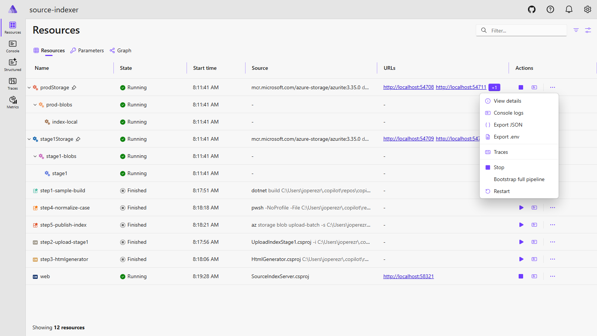

# Local inner loop (Aspire)

`src/source-indexer.AppHost/` is an [Aspire](https://aspire.dev) AppHost that
emulates the production indexing pipeline end-to-end against a tiny sample
library (`samples/MiniRuntime/`). It lets you exercise the full
binlog → HtmlGenerator → blob → SourceIndexServer chain locally without
pushing to ADO.

## Prerequisites

- **.NET SDK 10** (pinned in root `global.json`).
- **Docker / Podman** running locally (Azurite emulators run as containers).
- **Aspire CLI** — see <https://aspire.dev/docs/getting-started>.
- **Azure CLI** (`az`) on PATH — used by the `publish-index` step.

Then from the repo root:

```pwsh
aspire start
```

The dashboard URL (with login token) is printed to the console.

## Resource graph

Auto-started (running as soon as the AppHost is up):

| Resource | Type | Purpose |
|---|---|---|
| `stage1Storage` | Azurite emulator | Models `netsourceindexstage1` (V2 upstream upload destination). |
| `prodStorage`   | Azurite emulator | Models `netsourceindexprod` (final HTML index destination). |
| `stage1`        | Blob container under `stage1Storage` | Where `upload-stage1` drops the `.tar.gz`. |
| `index-local`   | Blob container under `prodStorage`   | Where the generated HTML index is uploaded. The web app reads from here. |
| `web`           | `SourceIndexServer` project          | ASP.NET Core app. `SOURCE_BROWSER_INDEX_PROXY_URL` is wired to `index-local` so it serves the indexed HTML out of Azurite. |

Explicit-start (stopped by default — click **Start** in the dashboard):

| Resource | Type | What it does |
|---|---|---|
| `step1-sample-build`    | Executable: `dotnet build /bl:` | Builds `samples/MiniRuntime` and produces `samples/MiniRuntime/bin/sample/msbuild.binlog`. |
| `step2-upload-stage1`   | Project: `UploadIndexStage1`    | Tars+gzips the sample folder + binlog and uploads it to `stage1`. Real V2 upstream tool — fully dogfooded. |
| `step3-htmlgenerator`   | Project: `HtmlGenerator`        | Runs `HtmlGenerator` on the binlog from `step1-sample-build` to produce static HTML under `bin/index/`. |
| `step4-publish-index`   | Executable: `az storage blob upload-batch` | Uploads `bin/index/index/` to the `index-local` container in `prodStorage`. |

## One-click bootstrap

The `prodStorage` resource exposes a custom **Bootstrap full pipeline**
command (internal id `bootstrap-all`) that runs the four pipeline
resources in order (`step1-sample-build` → `step2-upload-stage1` →
`step3-htmlgenerator` → `step4-publish-index`) and waits for each one to
finish. This is the easy first-run path:

1. `aspire start`
2. Open the dashboard.
3. On the `prodStorage` row, click the **⋯** button in the Actions
   column and choose **Bootstrap full pipeline**.
4. Wait for it to finish (watch the logs).
5. Open the `web` URL — you should see `MiniRuntime`'s indexed HTML.



Re-running any individual resource regenerates just that stage.

## How this maps to prod

| Prod | Local inner loop |
|---|---|
| V2 upstream repo publishes `.tar.gz` to `netsourceindexstage1/stage1/<repo>/<ts>.tar.gz` (`UploadIndexStage1`) | `step2-upload-stage1` resource → `stage1Storage/stage1` |
| `HtmlGenerator.exe` reads binlog + writes HTML to `bin/index/` (`src/index/index.proj`) | `step3-htmlgenerator` resource |
| `AzureFileCopy@6` uploads `bin/index/index/*` to `netsourceindexprod/index-<GUID>/` (`azure-pipelines.yml`) | `step4-publish-index` resource (`az storage blob upload-batch`) → `prodStorage/index-local` |
| App Service slot setting `SOURCE_BROWSER_INDEX_PROXY_URL` flipped to the new container (`deployment/deploy-storage-proxy.ps1`) | `web` resource started with `SOURCE_BROWSER_INDEX_PROXY_URL` env var pointing at `prodStorage/index-local` |

See `docs/handoff/03-indexing-pipeline.md` and
`docs/handoff/05-azure-pipeline.md` for the full prod mechanics.

## Auth: Azurite vs prod

Production uses managed identity (`TokenCredential`) to talk to Azure
Storage. Azurite only speaks shared-key / connection-string auth. To keep
both paths working without a fork, `SourceIndexServer/Models/AzureBlobFileSystem.cs`
and `UploadIndexStage1/Program.cs` check for `AZURE_STORAGE_CONNECTION_STRING`
in the environment:

- If set → use `BlobServiceClient(connectionString)` (Azurite-friendly).
- If not set → use the original `BlobServiceClient(uri, TokenCredential)`
  code path (prod-friendly).

Aspire injects the connection string automatically via `WithReference(...)`
on the blob resources in the AppHost. Prod is unaffected.

## Persistence

The two Azurite emulators use `ContainerLifetime.Persistent` and bind-mount
their data directories to `.azurite/stage1` and `.azurite/prod` at the repo
root. Blobs uploaded during a session survive `aspire start` restarts and
container recreations — to wipe state, just delete the `.azurite/` folder.
The folder is gitignored.

## Debugging individual components

The AppHost runs each stage as its own resource, but the underlying projects are normal .NET projects you can debug directly in **Visual Studio** or **VS Code**:

- **`HtmlGenerator`** (`src/SourceBrowser/src/HtmlGenerator/`) — set breakpoints, then either start it from the IDE pointing at an existing binlog under `samples/MiniRuntime/bin/sample/`, or attach to the `step3-htmlgenerator` process after kicking it off from the dashboard.
- **`SourceIndexServer`** (`src/SourceBrowser/src/SourceIndexServer/`) — F5 from the IDE for fast inner-loop on the web UI. To debug against Azurite data, set `AZURE_STORAGE_CONNECTION_STRING` and `SOURCE_BROWSER_INDEX_PROXY_URL` from the running AppHost (visible on the `web` resource's env vars panel in the dashboard) in your launch profile.
- **`UploadIndexStage1`** (`src/UploadIndexStage1/`) — same pattern: copy the env vars off the AppHost's `step2-upload-stage1` resource and run from the IDE.
- **`BinLogToSln`** (`src/SourceBrowser/src/BinLogToSln/`) — runnable directly against any `.binlog` produced by `step1-sample-build`.

The Aspire dashboard's per-resource "Environment" tab is the source of truth for the env vars Aspire injects — copy those into your `launchSettings.json` to reproduce the AppHost environment under a debugger.

## Open follow-ups

- **End-to-end OTel validation**: ServiceDefaults are wired into `SourceIndexServer` and `UploadIndexStage1`, but flowing traces across `HtmlGenerator` (net472) into the dashboard hasn't been validated yet.
